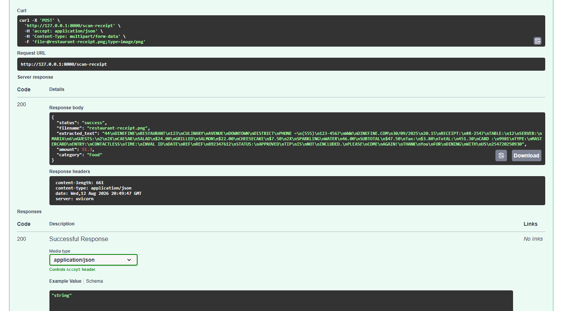

# Day 12 — AI Application Integration

## 🚀 Objective

Improve the AI Receipt Scanner and make it more application-ready with structured input, validation, error handling, and API integration.

## 🤖 Selected AI Feature

**AI Receipt Scanner & Smart Expense Processing**

Technologies:
- FastAPI
- EasyOCR
- OpenCV
- Python

## 🏗️ Integration Architecture

```text
User
 ↓
Website / Web App / Mobile App
 ↓
Backend API
 ↓
AI Receipt Scanner
 ↓
EasyOCR
 ↓
Amount & Category Processing
 ↓
Validation
 ↓
JSON Response
 ↓
Application
````

## 🔌 API

### Endpoint

```text
POST /scan-receipt
```

### Input

Receipt image in:

```text
JPG / JPEG / PNG
```

Maximum file size: **5 MB**

### Output

```json
{
  "status": "success",
  "filename": "restaurant-receipt.png",
  "amount": 51.3,
  "category": "Food"
}
```

## ✅ Validation & Error Handling

The API validates:

* File type
* File size
* Empty files
* OCR text
* Extracted amount
* Expense category

It also handles:

* `400` — Invalid input
* `413` — File too large
* `422` — Unreadable/invalid extracted data
* `500` — Processing error

## 💰 Amount Validation

OCR initially read the receipt total incorrectly as `451.30`.

The system validated it using:

```text
Subtotal = 47.50
Tax = 3.80

47.50 + 3.80 = 51.30
```

Final validated amount:

```text
51.30
```

## 🔐 Technical Considerations

* **Privacy:** Receipt images should be securely processed and temporary files deleted.
* **Security:** Authentication, HTTPS, file validation, and rate limiting should be used in production.
* **Cost:** EasyOCR currently runs locally, reducing external API costs.
* **Latency:** OCR processing may take longer than normal API requests.
* **Error Handling:** OCR results should be validated before saving financial data.

## 📸 Day 12 Test



The API successfully processed the receipt with:

```text
Status: 200 OK
Amount: 51.30
Category: Food
```

## 📌 Conclusion

The Receipt Scanner POC is now more application-ready with structured API input, OCR processing, financial validation, error handling, and a clear integration architecture.

```

